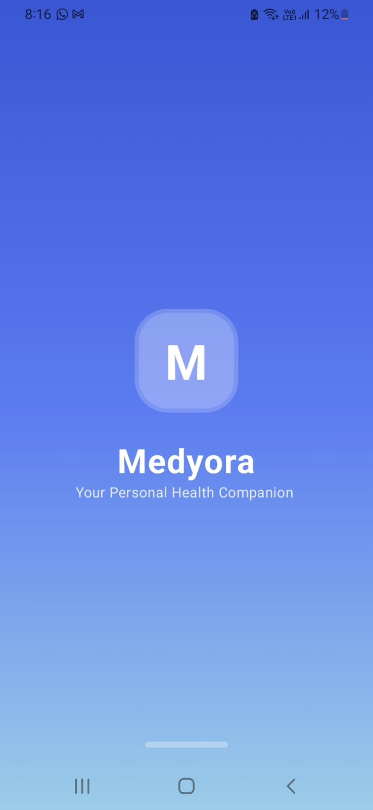
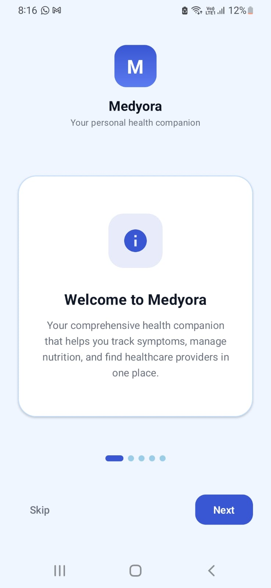
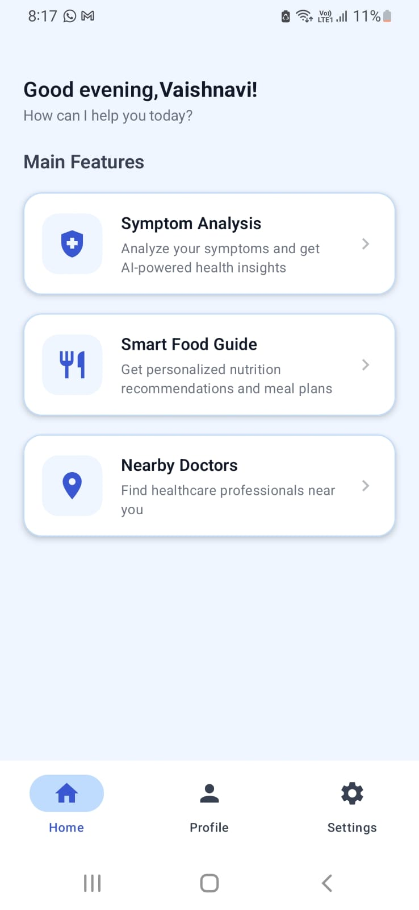
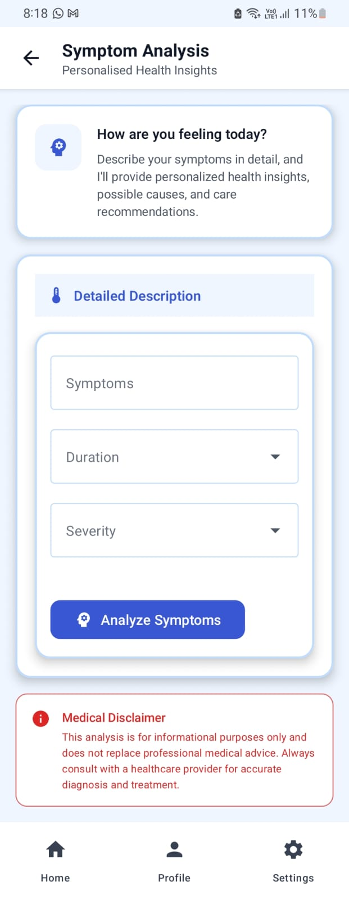
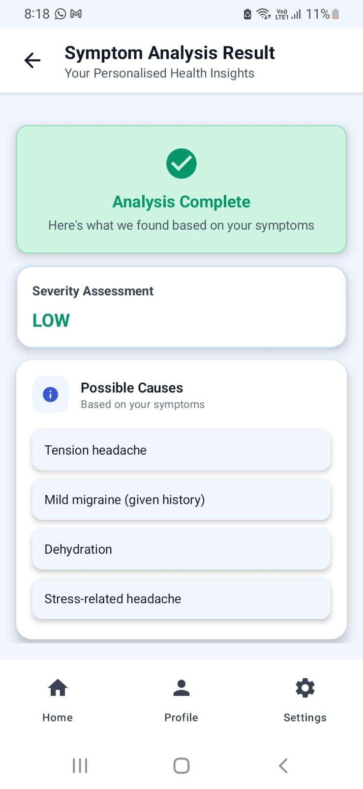
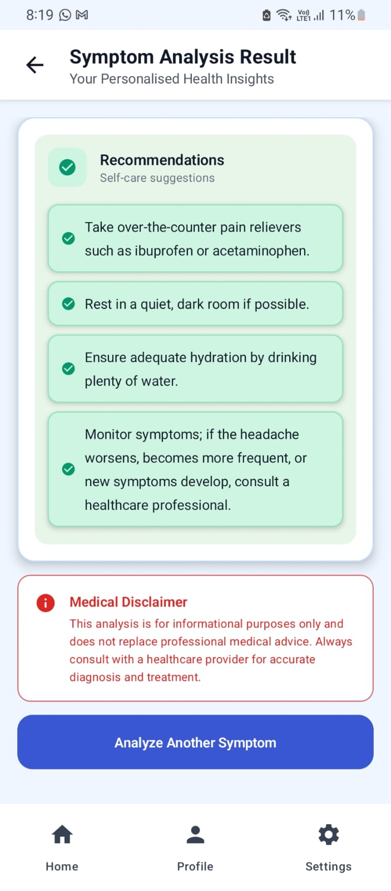
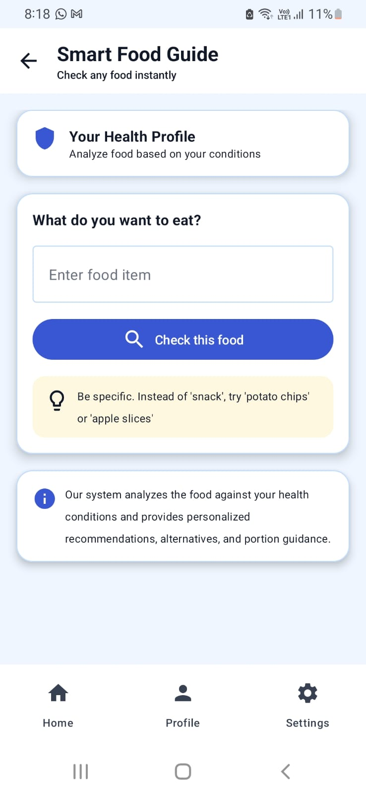
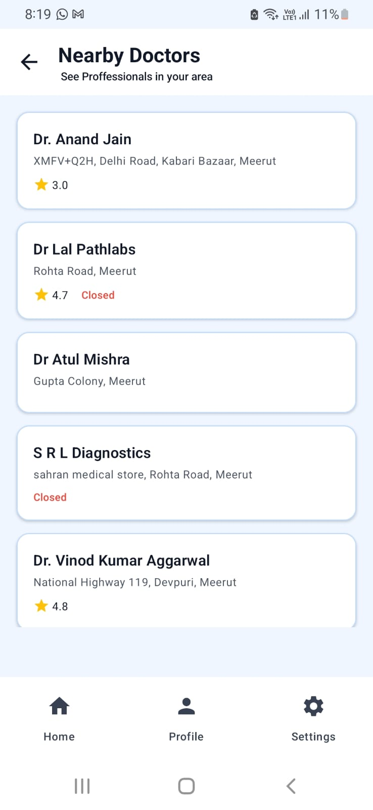
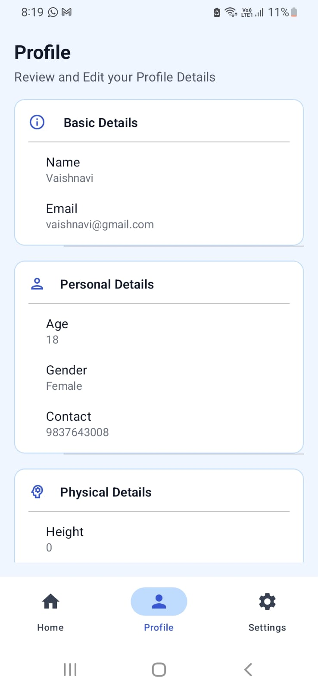
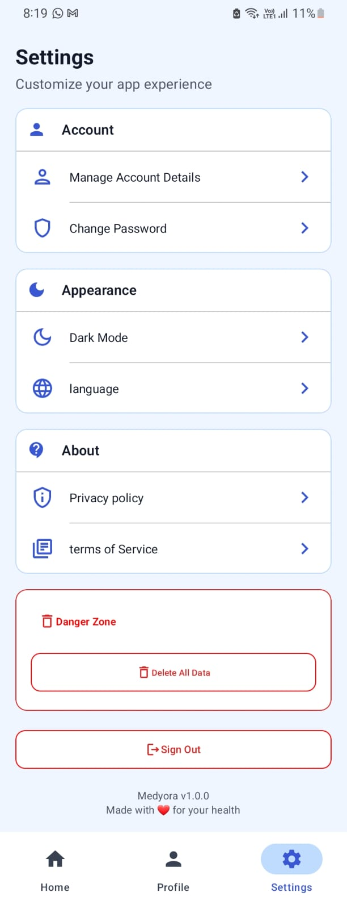

# Medyora

## 📌 Overview

Medyora is an Android application built to integrate all essential health-related needs of a user into a single, personalized experience. Instead of switching between multiple apps for health queries, Medyora gives users AI-powered symptom insights, personalized food guidance based on their health conditions, and real-time nearby doctor discovery — all driven by the user's own health profile.

Built as a portfolio project to demonstrate production-level Android development using modern Jetpack libraries, clean MVVM architecture, and real AI integration via the Gemini SDK.


## 🎥 Demo Video

📺 Watch the full app walkthrough:

[▶ Click here to watch demo](https://drive.google.com/file/d/1Ovx2dtCkjvKbbwoWi9EYFhflM-C0IkEQ/view?usp=drivesdk)

---

## 🚀 Features


### **AI-Powered Symptom Analysis**
- User describes symptoms with duration and severity
- Gemini SDK builds a structured prompt enriched with the user's health profile (age, gender, conditions, activity level)
- Multi-turn flow: AI may ask one follow-up question before delivering final results
- Results include possible causes, risk level assessment, and personalized care recommendations
- Full error handling for AI quota, network failure, and response parse failures

### **Smart Food Guide**
- User enters any food item
- AI analyzes it against the user's known health conditions
- Returns safety assessment (SAFE / CAUTION / RISKY / UNSAFE), health impact, portion guidance, and healthier alternatives
- Personalized — the same food may have different results for different health profiles

### **Nearby Doctors**
- Requests location permission at runtime
- Fetches nearby doctors and clinics via Google Places API
- Displays name, address, rating, and open/closed status
- Handles permission denied state and no results state gracefully

### **Firebase Authentication**
- Email and password sign up and sign in
- Typed error handling: wrong password, user not found, email already exists, and network errors all show distinct user-facing messages
- Secure sign out and full account deletion with Firestore data cleanup

### **Health Profile Management**
- Multi-step onboarding: personal details, physical details, medical history
- Medical conditions selected via chip UI with custom additions
- Profile persisted to Firestore and used to personalize all AI features
- Profile viewable and editable post-onboarding


---

## 📸 Screenshots

| Splash | Welcome | Home |
|--------|---------|------|
|  |  |  |

| Symptom Input | Symptom Result | Food Guide |
|---------------|----------------|------------|
|  |  | |  |

| Nearby Doctors | Profile | Settings |
|----------------|---------|----------|
|  |  |  |

---


## 🛠 Tech Stack

| Category | Technology |
|----------|------------|
| Language | Kotlin |
| UI | Jetpack Compose + Material 3 |
| Architecture | MVVM + Repository pattern |
| State Management | StateFlow + sealed UiState classes|
| DI | Hilt (Dagger) |
| Async | Kotlin Coroutines |
| Navigation | Navigation Compose |
| Backend / Auth | Firebase Authentication, Cloud Firestore |
| AI | Google Generative AI SDK (`generativeai`) — Gemini `gemini-2.5-flash` |
|  Location | Google Places Nearby Search (Retrofit), Play Services Location |
| Networking | Retrofit 2, OkHttp (debug logging only), Gson |
| Other | AndroidX Core, Lifecycle, Activity Compose, AppCompat |

---

## 🏗 Architecture

Medyora follows **MVVM** with a **Repository** data layer and **Hilt** dependency injection.

```
UI (Compose screens)
    ↓
ViewModel (StateFlow / Compose state, viewModelScope)
    ↓
Repository (Firebase, Gemini, Retrofit)
    ↓
External services (Firebase, Gemini API, Google Places API)
```

- **UI layer** — Jetpack Compose screens in `screens/` and `Authentication/`; shared components in `ui/components/`.
- **ViewModel layer** — Feature ViewModels expose UI state (mostly `StateFlow`; auth/splash use Compose `mutableStateOf`).
- **Repository layer** — `UserRepository`, `AuthRepo`, `DoctorsRepository`, and AI repositories orchestrate Firestore, Auth, Places, prompts, and parsing.
- **State management** — Sealed UI states per feature (e.g. `SymptomFlowState`, `FoodFlowState`); repositories return Kotlin `Result<T>` or sealed output types (`SymptomAnalysisOutput`).
- **Error handling** — `AppException` sealed hierarchy, `Throwable.toAppException()` mapper, and `toUserMessage()` for display.
- **Navigation** — Root graph (splash, auth, onboarding) in `navigation/Navigation.kt`; main app graph (home, profile, settings, features) in `navigation/MainRoutes.kt`.

There is no separate domain module or use-case layer; the app is a single-module structure.

---

## 📁 Project Structure


```
app/src/main/java/com/palak/medyora/
├── Authentication/       # Firebase Auth screens and ViewModel
├── di/                   # Hilt modules (AiModule, NetworkModule)
├── model/                #  Domain models and sealed output classes
├── navigation/           # Root and main NavHost graphs
├── Repository/           # Data layer — Firebase, Gemini, Places, prompts, JSON parsing
├── screens/              # Compose screens
├── ui/
│   ├── components/       # Reusable composables (errors, top bar, cards)
│   └── theme/            # Colors, typography, MedyoraTheme
├── utils/                # AppException, ExceptionMapper, typed error handling
├── viewmodels/           # Feature ViewModels
├── MainActivity.kt
└── Medyora.kt            # @HiltAndroidApp Application
```

---

## ⚙ Setup Instructions

### Prerequisites

- Android Studio Hedgehog or later
- JDK 8+ (project targets JVM 1.8)
- A Firebase project with **Authentication** (Email/Password) and **Cloud Firestore** enabled
- A **Gemini API key** (Google AI Studio)
- A **Google Places API key** with Places API enabled
- Android device or emulator running API 26+

### 1. Clone the repository

```bash
git clone <your-repo-url>
cd Medyora
```

### 2. Firebase configuration

1. In the [Firebase Console](https://console.firebase.google.com/), create or select a project.
2. Add an Android app with package name: `com.palak.medyora`.
3. Download `google-services.json` and place it in:

   ```
   app/google-services.json
   ```

4. Enable **Email/Password** sign-in under Authentication.
5. Create a Firestore database and configure security rules so users can only read/write their own document, for example:

   ```
   match /users/{userId} {
     allow read, write: if request.auth != null && request.auth.uid == userId;
   }
   ```

### 3. API keys

Create or edit `gradle.properties` in the project root (this file is gitignored):

```properties
GEMINI_API_KEY=your_gemini_api_key_here
PLACES_API_KEY=your_google_places_api_key_here
```

Keys are injected into `BuildConfig` at compile time.


**Getting the keys:**
- **Gemini API key** — [Google AI Studio](https://aistudio.google.com)
- **Google Places API key** — [Google Cloud Console](https://console.cloud.google.com) → Enable Places API → Create credentials


### 4. Open and sync

1. Open the project in Android Studio.
2. Let Gradle sync finish (internet required for dependencies).
3. Connect a device or start an emulator (API 24+).

### 5. Run

Select the `app` configuration and run. On first launch you will see the splash screen, then onboarding or sign-in depending on auth state.


---

### Key Architecture Decisions

**Typed error handling** — All errors across the app flow through a sealed `AppException` hierarchy. Raw exceptions are mapped once in `ExceptionMapper.kt` via a `Throwable.toAppException()` extension. Every ViewModel receives typed exceptions, and the UI renders specific user-facing messages via `toUserMessage()`. No hardcoded error strings anywhere in the codebase.

**Unidirectional data flow** — Each feature has a separate `flowState` (which screen to show) and `uiState` (form field values and inline validation errors). The ViewModel is the single source of truth. The UI never performs logic — it only renders and dispatches events.

**Scoped ViewModel sharing** — Profile and EditProfile screens share the same ViewModel instance scoped to the PROFILE back stack entry, so edits reflect immediately without an extra network call.

**AI response parsing** — Gemini returns free-text containing JSON. A dedicated parser extracts the JSON block, validates structure, and maps it to typed Kotlin data classes before the ViewModel ever sees the response. Parse failures are caught and mapped to `AppException.AiResponseParseException`.


---

## 🔐 Permissions Used

| Permission | Purpose |
|------------|---------|
| `INTERNET` | Firebase Auth/Firestore, Gemini API, and Google Places API network requests. |
| `ACCESS_FINE_LOCATION` | Read device coordinates to search for nearby doctors when the Nearby Doctors feature is opened. |
| `ACCESS_COARSE_LOCATION` | Declared alongside fine location; the app requests fine location at runtime for doctor search. |

---


## 🚧 Future Improvements

Planned or documented improvements (not yet implemented):

This is a portfolio project scoped for learning and demonstration. Production improvements would include:

- **API key security** — Move Gemini and Places API calls through a backend proxy so keys are never embedded in the APK
- **Unit tests** — The AI response parser and prompt-building logic are the most critical paths to test
- **Modular Gradle** — Split into feature modules for better build performance at scale
- **Retry logic** — Exponential backoff on transient network failures
---


## **Medical Disclaimer**

Medyora is built for informational and educational purposes only. AI-generated symptom analysis and food guidance are not a substitute for professional medical advice, diagnosis, or treatment. Always consult a qualified healthcare provider for medical decisions.

---

## 👤 Author

- **Name:** [Palak Singhal ]
- **Gmail:** [palaksinghal148@gmail.com]
- **Linkedin:** [https://linkedin.com/in/palak-singhal-14a78324a]

---
